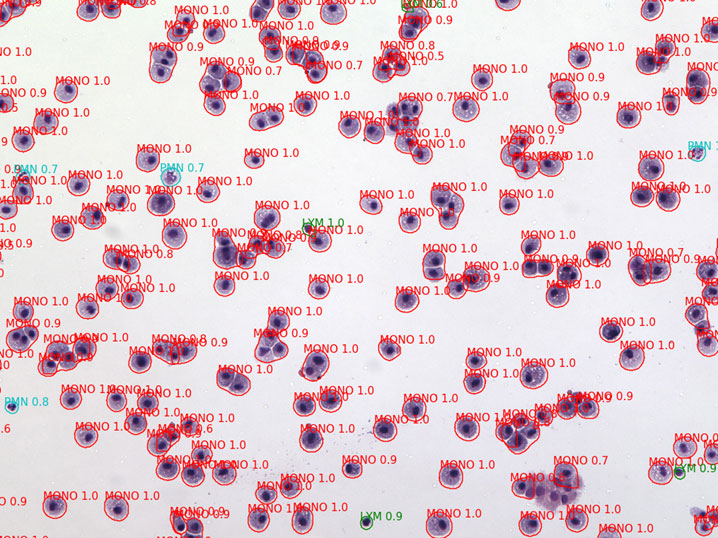

# 肺神经网络

我们展示了 U-Net 和 Mask R-CNN 等卷积神经网络在以下方面的作用：

- 有效评估 肺部病理损伤。
- 详细表征 正常肺组织学。
- 精确检测和分类 BALF 细胞。

总体而言，这些先进的方法可以提高肺细胞学和组织病理学的效率和量化分析。

## U-Net 架构的应用

本项目使用的卷积神经网络架构灵感来自 [U-Net](http://lmb.informatik.uni-freiburg.de/people/ronneber/u-net/) 和 双框架的 [dual frame U-Net](https://arxiv.org/abs/1708.08333) 并添加了来自预训练 Keras 模型的迁移学习功能 ([keras-applications](https://keras.io/applications/)).

### 肺病理学

经过**14**对图像的训练，神经网络能够在验证集上识别肺实质区域的准确率达到**>90%** (DICE 系数)，识别肺部严重炎症的准确率达到**>60%**。

下面显示了单独图像的预测结果，包括分割蒙版图和区域统计信息。

多标签叠加 (蓝色：肺实质，红色：严重炎症)

|   | 肺实质  |  严重炎症 |
|---|---|---|
| 36_KO_FLU_1.jpg | 836148 | 203466 |

### 肺组织学

经过 **16张全玻片扫描** (3:1 训练验证分割) 后，神经网络能够识别正常小鼠肺切片 (相当于 10 倍放大，从全玻片扫描裁剪) 中的各种区域。

构建了 U-Net 的变体来执行以下操作：

- **单类别分割**
    - 输出：sigmoid
    - 损失函数：DICE 和二元交叉熵
- **多类别分割**
    - 输出：softmax
    - 损失函数：多类别交叉熵

其中，双框架 U-Net 的性能略优于单框架 U-Net。
虽然更耗时，但单类别分割结合 argmax 实现了比单个多类别分割模型更好的分类结果，尤其对于欠代表的类别。

最佳结果如下：

- 单类别分割 (DICE 系数)
    - 背景：97%
    - 导管：84%
    - 结缔组织：83%
    - 大血管：78%
    - 呼吸道：97%
    - 小血管：63%
- 多类别分割 (准确率)
    - 所有六类：96%

这些方法有助于识别和量化肺部各种结构或组织类型，并可扩展到发育异常或病变区域。

非肺实质区域高亮图像

六色分割映射图

## Mask R-CNN 的应用

Mask R-CNN 由 [何恺明, 2017](https://arxiv.org/abs/1703.06870) 开发，可同时执行实例分割、边界框目标检测和关键点检测。

该项目基于 [matterport](https://github.com/matterport/Mask_RCNN) 的实现，并具有以下附加功能：

- 支持更多卷积主干网络，包括 vgg 和 densenet。
- 通过图像切片和合并图像和检测结果来支持处理大型图像。
- 模拟支气管肺泡灌洗液样本，从背景和代表性细胞图像中进行高效训练。
- 批量评估模型的平均精度 (mAP)。

### 支气管肺泡灌洗液细胞学

经过 3:1 的训练和验证，使用 21 张背景图像包含 26 个淋巴细胞、95 个单核细胞和 22 个多形核白细胞进行训练后，神经网络能够在小鼠肺部支气管肺泡灌洗液（20 倍物镜）中检测和分类这些细胞类型。

经过一天的训练，平均精度(mAP)表示的准确率 已经达到所有类别的 75%。单核细胞类别的准确率最高。

数据来源: Jeanine D'Armiento, Monica Goldklang, Kyle Stearns; Columbia University Medical Center
